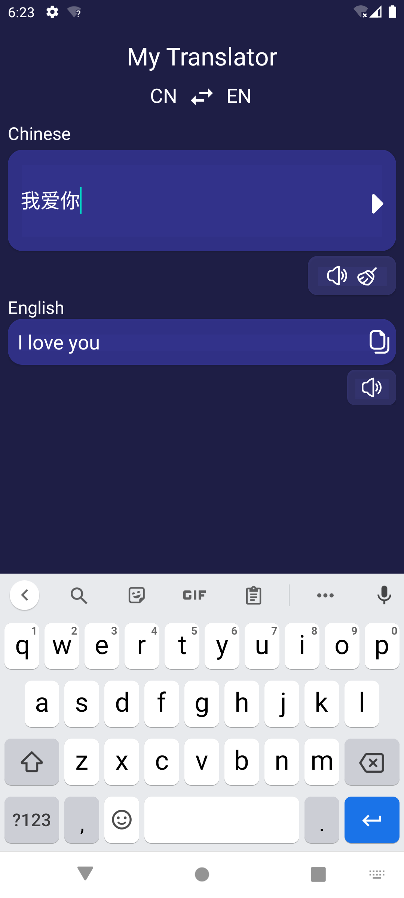
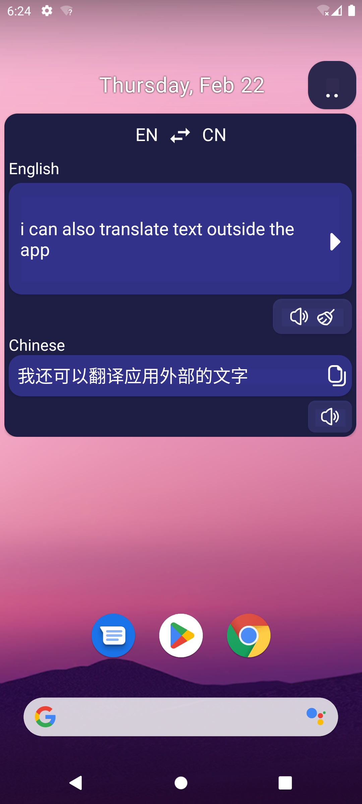

# Android-FloatingWindow-Translator
This Android app introduces a seamless translation experience by implementing a floating window feature. With this innovative functionality, users can translate text without switching between apps. Simply activate the floating window, and effortlessly translate text from any screen or application.

## Dependencies

To integrate the translation functionality into your project, add the following dependency to your app's `build.gradle` file:

```gradle
dependencies {
    implementation 'com.google.mlkit:translate:17.0.1'
}
  ```

This dependency is crucial for enabling the translation feature within your application.

### App Images




## Features:
- Floating Window Translation: Translate text from any screen or application using a convenient floating window.
- Effortless Translation: Enjoy seamless translation without the need to switch between apps.
- On-the-Fly Translations: Translate text instantly as you encounter it, ensuring a smooth and uninterrupted workflow.
- User-Friendly Interface: Access translation features with ease, thanks to an intuitive and user-friendly interface.
- Get started with TranslateFloatingWindow-Android and simplify your translation experience today!

 
 #### Troubleshooting

- If you encounter any build errors, check that Android Studio is updated to the latest version and that all plugins and dependencies are correctly configured.
- For database connection issues, verify that XAMPP's MySQL service is running and that your database credentials are correct in the PHP backend files.

Following these steps should help you successfully set up and run the Android application.

## Contributing

Feel free to contibute to this project , you can also add new features to make it more better , Thanks ...
